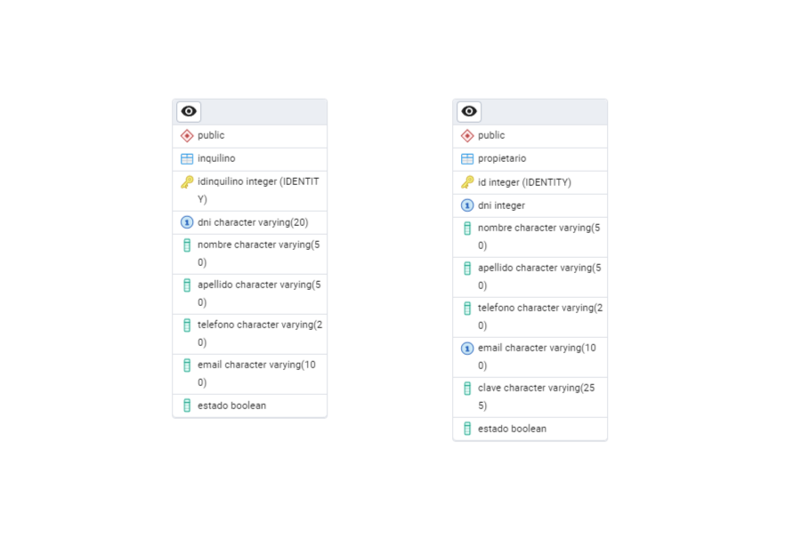

# Proyecto Inmobiliaria MVC

## Descripción

Sistema de **gestión de alquileres** desarrollado en **ASP.NET** con **PostgreSQL** como motor de base de datos.  
Actualmente permite realizar el **ABM (Alta, Baja, Modificación) de propietarios e inquilinos**.



## Entidades

### Propietario

- Representa a los dueños de uno o varios inmuebles.
- Funciones: ABM completo (crear, modificar, eliminar y listar propietarios).
- Columnas principales: `id`, `dni`, `nombre`, `apellido`, `telefono`, `email`, `clave`, `estado`.

### Inquilino

- Representa a las personas que contratan inmuebles.
- Funciones: ABM completo (crear, modificar, eliminar y listar inquilinos).
- Columnas principales: `idInquilino`, `dni`, `nombre`, `apellido`, `telefono`, `email`, `estado`.

## Herramientas

- [PostgreSQL](https://www.postgresql.org/download/) (DBMS)
- [pgAdmin](https://www.pgadmin.org/download/) (opcional, para administrar la base de datos)
- [.NET SDK](https://dotnet.microsoft.com/download) (para ejecutar la aplicación ASP.NET Core)

## Instalación y uso

### 1. Clonar el repositorio

```bash
git clone https://github.com/JaGo-1/Gomez-Godoy-inmobiliaria-mvc.git
cd Gomez-Godoy-inmobiliaria-mvc
```

### 2. Crear la base de datos

```bash
CREATE DATABASE inmobiliariabd;
```

### 3. Crear la estructura de tablas

- Abrir Database/schema.sql.
- Ejecutar el script para crear las tablas propietario e inquilino vacías.

### 4. Cargar datos de prueba (opcional)

- Abrir Database/seeder.sql.
- Ejecutar el script para insertar datos simulación y reiniciar los IDs de las tablas.

### 5. Ejecutar la aplicación

```bash
dotnet run
```

### Integrantes

- [Jacqueline Estefania Gomez](https://github.com/JaGo-1)
- [Santiago Godoy](https://github.com/SantiMGodoy)
